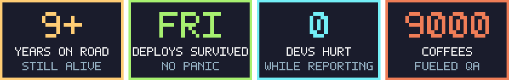

<p align="center">
  
</p>


```
NAME ........... Ruslan Pryimak
CLASS .......... Senior QA Engineer
XP ............. 9+ years
BASE ........... San Francisco Bay Area
WORLDS ......... iOS · Android · Web · IoT · CarPlay · Android Auto
PLAYSTYLE ...... co-op 🤝 team first, process always
SPECIAL MOVE ... turns "almost ready" into a release everyone trusts
TRAINING ....... MSc, Electrical & Computer Engineering
```

For me, quality is a team sport. It isn't a gate at the end. It's a shared habit: a clear test strategy, a predictable release rhythm, and docs good enough that a new teammate gets going on day one.

These days I help ship the **Honda & Acura** mobile app at Drivemode, working hand in hand with Honda teams. Before that I spent four years at **Lyft** on maps & navigation used by millions of riders and drivers.





| Slot | Items |
|---|---|
| ⚔️ **Main weapon** | Test strategy & planning · risk-based testing · release readiness · root cause analysis |
| 🤝 **Party buffs** | Mentoring · onboarding guides · cross-team alignment · clear bug reports · Agile/Scrum |
| 🛡️ **Armor** | Functional, regression, exploratory, usability, accessibility, localization & API testing |
| 🔧 **Toolbelt** | Jira · TestRail · Azure DevOps · Postman · Charles Proxy · Android Studio · Xcode · Git · CI/CD |
| 🤖 **Summons** | Selenium · Appium · Java · Python · JavaScript · SQL |
| 📡 **Rare loot** | Firmware & hardware testing: radio, optical and wired links; stress-testing real devices in the lab |
| 🎖️ **Badges** | ISTQB · Google IT Automation with Python · Generative AI Automation · Business Analysis |


**🚗 Drivemode (Honda)** · *Senior QA Engineer* · 2025 – now<br>
Owning QA for critical areas of the global Honda & Acura companion app: coordinating release cycles, aligning with Honda teams on tricky issues, and building the guides, test-data kits and API snippets that get teammates up to speed fast.

**🗺️ Lyft** · *Senior QA Engineer* · 2021 – 2025<br>
Maps & navigation for riders and drivers across the U.S. and Canada, including CarPlay and Android Auto. Designed the test strategy for new map styles: **95%** coverage and **60%** fewer incoming bug reports.

**📺 EPAM** · *Senior Software Testing Engineer* · 2020 – 2021<br>
Mentored junior QAs (**+40%** team productivity) and built reusable regression suites for TV set-top boxes (**−25%** run time). Led QA for an insurance web platform from zero to launch, working with PMs and devs to catch edge cases early (**−30%** post-release defects).

**🌾 HiQo Solutions** · *QA Engineer* · 2019<br>
The bridge between a European dev team and U.S. stakeholders on a farm-management platform. Redesigned the QA repository and regression suites: **+35%** test efficiency, **−40%** bug fix time. Plus a smart-home IoT prototype.

**⚡ Nero Electronics** · *Software & Hardware Testing Engineer* · 2017 – 2018<br>
Led QA for smart metering systems, from firmware to lab stress tests. Shipped with **99%** customer satisfaction.


<p align="center">
  <a href="https://www.linkedin.com/in/ruslan-pryimak"></a>
</p>

<p align="center">
  
</p>
